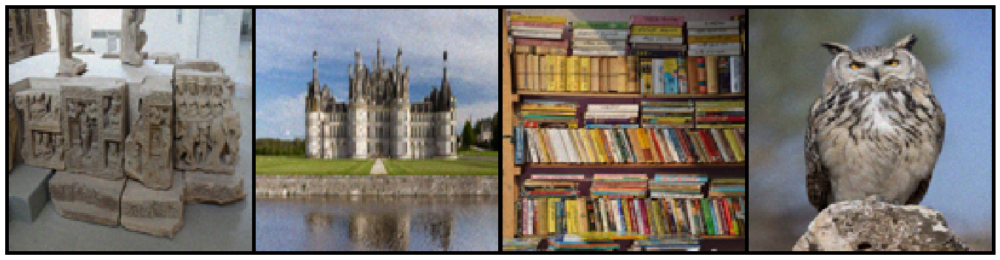
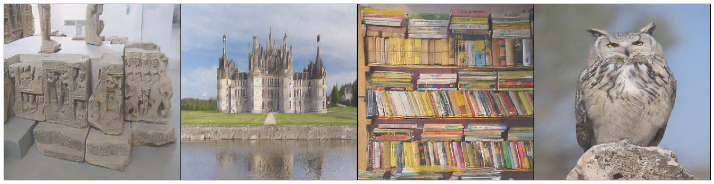
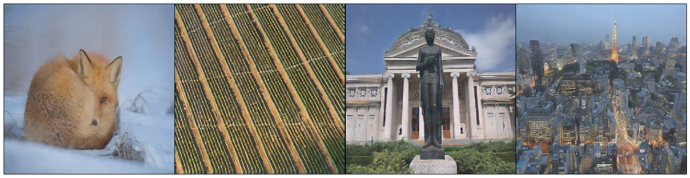
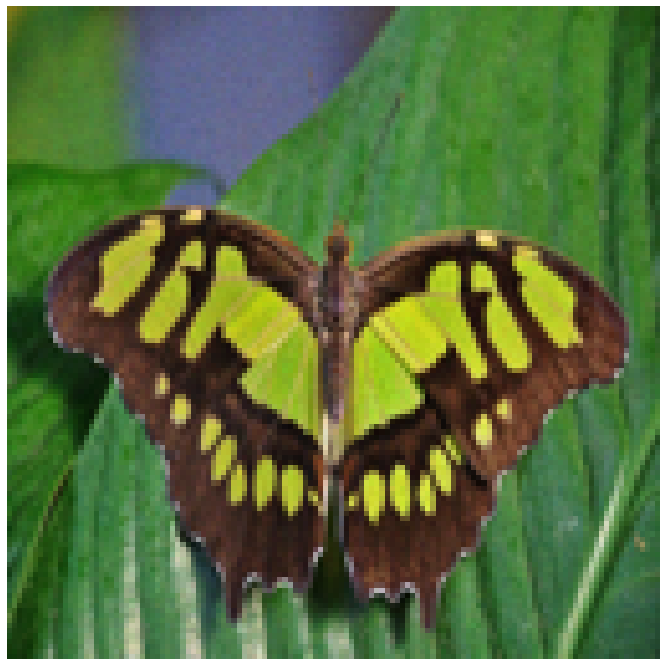
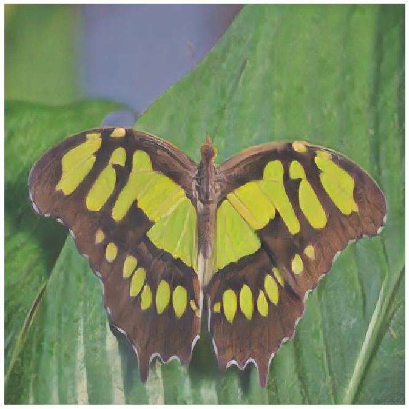
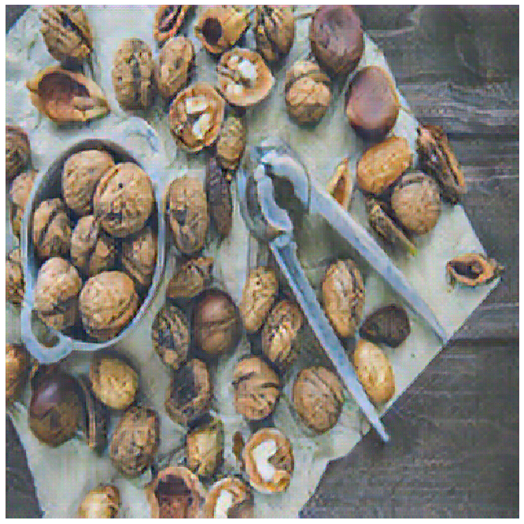

# Image-Enhancer-via-ESRGAN
The utilities developed in this tool are based off of the ESRGAN Paper: https://arxiv.org/abs/1809.00219

This tool enhances image resolution quality using deep convolutional neural networks. The idea is to train two neural networks to work against each other (the fundamental principle of Generative Adversarial Networks or GAN for short). A Generator is first trained a specified number iterations over the ground truth pixel loss using Mean Absolute Error or L1Loss. After the period of pixel loss is finished, the GAN is also tested on content loss (perceptual similarity) as well as the minimax GAN loss. The Discriminator is also introduced being trained on GAN loss. 

## Sample Low Resolution Images

## GAN Enhanced Super Resolution Samples

## One-to-One Comparions (Low Res --> Enhanced)

### 150 Epochs Trained
 

### 50 Epochs Trained
 

### 25 Epochs Trained
 
